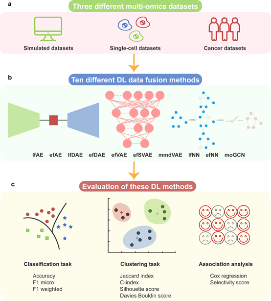

# DL-mo
## A benchmark study of deep learning based multi-omics data fusion methods for cancer
***
  
We here compare the performances of 10 deep learning methods in three contexts: 
1. samples clustering from multi-omics simulated data
2. ability to identify factors associated with survival or clinical annotations and metagenes associated with biological annotations (Reactome, GO, Hallmarks) in bulk multi-omics TCGA data from 10 cancer types.
3. cells clustering based on scRNA-seq and scATAC-seq data from three cell lines.       

We use `python` and `R` to code the programs.   
***
## 10 deep learning methods
* [lfAE](./python-scripts/runCancerAE2.py)
* [efAE](./python-scripts/runCancerAE.py) 
* [lfDAE](./python-scripts/runCancerDAE2.py) 
* [efDAE](./python-scripts/runCancerDAE.py) 
* [efVAE](./python-scripts/runCancerVAE.py)
* [efSVAE](./python-scripts/runCancerSVAE.py) 
* [mmdVAE](./python-scripts/runCancerMMDVAE.py) 
* [lfNN](./python-scripts/runCancerDNN.py) 
* [efNN](./python-scripts/runCancerDNN.py)
* [moGCN](./python-scripts/)
***
## Install the R software environment
Use conda to create a new environment: `conda create -n momix -c conda-forge -c bioconda -c lcantini momix r-irkernel`
***
## Install the python software environment
You need to build a virtual environment for python.    
You need to install the following main libraries: `Python==3.7.0,Tensorflow==1.15.0, scikit-learn==0.20.0, Jupyter==1.0.0`.

